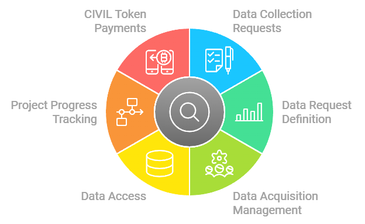

# CivilAirspace

While our skies remain largely unused, property owners and drone operators await clear paths forward. CivilAirspace creates a decentralized coordination layer that enables communities to thoughtfully integrate drone technology into their airspace, ensuring controlled, purposeful usage that respects both innovation and tranquility.

 

## Overview

CivilAirspace is a decentralized platform that enables property owners, drone operators, researchers, and data consumers to coordinate drone operations in low-altitude airspace. The platform facilitates airspace licensing, data acquisition, compliance monitoring, and tokenized payments using CIVIL tokens.

## Use Cases

- **[Research Data Collection](docs/use_cases/Research_Data_Collection.md)**:  
  University researchers can submit data collection requests through CivilAirspace to acquire aerial survey data for various research purposes. Researchers can define parameters such as location, altitude, and frequency of data collection. Drone operators fulfill these requests by capturing the required data using drones. Collected data is then delivered back to the researchers through the CivilScout App, where they can review and analyze it. Payments are processed using CIVIL tokens, ensuring seamless transactions between researchers and drone operators.

- **[[Ad-Hoc Data Collection]]**:  
  CivilScouts can submit spontaneous data requests based on real-time observations in specific locations. For example, a CivilScout hiking in Yosemite may spot a black bear but be unable to capture a photo. Using the Ad-Hoc Data Collection feature in the CivilScout App, they can leave a geo-tagged request asking other scouts or drone operators to capture an image of the bear if they see it. These requests remain active for a specified duration (e.g., 24 hours), allowing others nearby to fulfill them by submitting the requested data. Once fulfilled, payments are processed using CIVIL tokens, rewarding those who contribute valuable data.

## [CivilScout App](docs/CivilScout_App.md)

The **[[CivilScout App]]** is designed for researchers and data consumers to:
- Submit data collection requests.
- Define data requests (and request parameters).
- Manage data acquisitions.
- Access collected data.
- Track project progress.
- Manage CIVIL token payments.

## [Airspace Owner App](docs/Airspace_Owner_App.md)

The **Airspace Owner App** is tailored for property owners to:
- Set up and manage airspace schedules.
- Configure usage parameters.
- Set pricing preferences.
- Monitor airspace activity.
- Manage CIVIL token earnings.
- View analytics and reports.

## [Drone Operator App](docs/Drone_Operator_App.md)

The **Drone Operator App** provides drone operators with tools to:
- Discover available airspace.
- Book flight paths.
- Monitor operations.
- Sell collected data.
- Manage CIVIL token revenues.
- Track compliance with regulations.

## [Nodes](docs/Nodes.md)

1. **[Control Towers](docs/Control_Towers.md)**  
   - Real-time airspace coordination.
   - Traffic management and routing.
   - Human operator interface.
   - Emergency response coordination.
   - Performance monitoring.
   - Compliance enforcement.

2. **[Credentialing Nodes](docs/Credentialing_Nodes.md)**  
   - Participant validation.
   - Credential verification.
   - Airspace ownership verification.
   - Compliance monitoring.
   - Changes in ownership/credentials.

3. **[Droneports](docs/Droneports.md)**  
   - Droneport operations.
   - Landing/takeoff management.
   - Physical infrastructure management.

4. **[Safety Nodes](docs/Safety_Nodes.md)**  
   - Emergency response coordination.
   - Local compliance monitoring.
   - Safety protocol enforcement.
   - Incident reporting.

## [Tokenomics](docs/Tokenomics.md)

The CIVIL token powers coordination across CivilAirspace by enabling:
- Airspace licensing and payments between parties (e.g., drone operators and airspace owners).
- Node operator earnings for managing infrastructure (e.g., control towers, credentialing nodes).
- Data marketplaces where drone operators can sell collected data to researchers or other buyers.
- Network governance through token-based voting mechanisms.

## Economic Design

The CivilAirspace network operates with a corporate economic structure:
1. The network generates revenue by facilitating drone operations, managing airspace usage, and ensuring compliance with local regulations.
2. After covering operational costs (e.g., node maintenance, regulatory compliance), any remaining net profit is distributed as dividends among participants (e.g., drone operators, airspace owners).
3. Dividends are distributed in CIVIL tokens via smart contracts that automate payments based on each participant's role in the network.

For more details on the economic design of CivilAirspace, refer to the [Economic Design Documentation](CivilAirspace/Economic_Design).

## [Protocol Design](docs/protocol/Protocol_Design.md)

The CivilAirspace protocol includes base-level contracts that enable:
1. Airspace licensing between property owners and drone operators.
2. Token distribution for payments within the ecosystem (e.g., for data acquisition or airspace usage).
3. Data marketplace transactions where buyers can purchase aerial data from drone operators or camera owners.
4. Network governance through token-based voting mechanisms for decision-making processes (e.g., fee adjustments or protocol updates).
5. Compliance monitoring to ensure safe and legal drone operations within regulated airspaces.

## [Partners](docs/partners/Partners.md)

1. **[Droneports](docs/partners/Droneports.md)**  
   Organizations providing droneports, docking stations, and refueling hubs for our decentralized network.

2. **[Public Safety](docs/partners/Public_Safety.md)**  
   Organizations focused on public safety, emergency response, and disaster relief operations using drones.

3. **[Airspace Owners](docs/partners/Airspace_Owners.md)**  
   Property owners with verified rights to license their airspace for drone operations within CivilAirspace's decentralized framework.

## Documentation Index

### Protocol Design
- [Protocol Design Overview](docs/protocol/Protocol_Design.md)
- [Tokenomics Overview](tokenomics/Tokenomics)

### Apps
- [Airspace Owner App Overview](apps/Airspace_Owner_App)
- [Drone Operator App Overview](apps/Drone_Operator_App)
- [CivilScout App Overview](apps/CivilScout_App)

### Node Types
- [Control Towers Overview](nodes/Control_Towers)
- [Credentialing Nodes Overview](docs/nodes/Credentialing_Nodes.md)
- [Droneports Overview](nodes/Droneports)
- [Safety Nodes Overview](nodes/Safety_Nodes)

### Partners
- [Airspace Owners Overview](docs/partners/Airspace_Owners.md)
- [Droneports Overview](docs/partners/Droneports.md)
- [Public Safety Overview](docs/partners/Public_Safety.md)

### Infrastructure
- [IPFS Integration Details](docs/infrastructure/ipfs.md)
- [Node Operations Details](docs/infrastructure/nodes.md)
- [Droneport Infrastructure Details](docs/infrastructure/droneports.md)