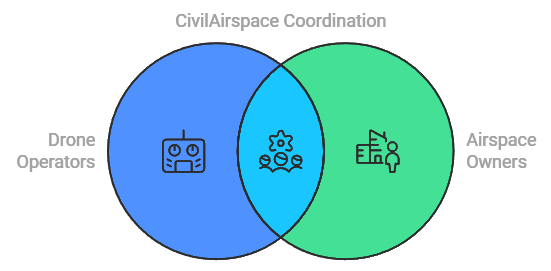

# CivilAirspace

While our skies remain largely unused, property owners and drone operators await clear paths forward. CivilAirspace creates a decentralized coordination layer that enables communities to thoughtfully integrate drone technology into their airspace, ensuring controlled, purposeful usage that respects both innovation and tranquility.

# Apps and Interfaces

### Airspace Owner App
A dedicated mobile application for property owners to:
- Set up and manage airspace schedules
- Configure usage parameters
- Set pricing preferences
- Monitor airspace activity
- Manage CIVIL token earnings
- View analytics and reports
- [Learn more about the Airspace Owner App](docs/Airspace_Owner_App.md)

### Drone Operator App
A specialized interface for drone operators to:
- Discover available airspace
- Book flight paths
- Monitor operations
- Sell collected data
- Manage CIVIL token balance
- Track compliance 
- [Learn more about the Drone Operator App](docs/Drone_Operator_App.md)

## Nodes

1. **Control Towers**
   - Real-time airspace coordination
   - Traffic management and routing
   - Human operator interface
   - Emergency response coordination
   - Performance monitoring
   - Compliance enforcement

2. **Credentialing Nodes**
   - Participant validation
   - Credential verification
   - Airspace ownership verification
   - Compliance monitoring
   - Changes in ownership/credentials

3. **Droneports**
   - Droneport operations
   - Landing/takeoff management
   - Physical infrastructure management

4. **Safety Nodes**
   - Emergency response 
   - Local compliance 
   - Safety monitoring
   - Incident reporting   

## Partners

1. **Autonomous Drone Technology Partners**  
   Companies specializing in autonomous drone technology that can help us automate drone operations and integrate advanced AI capabilities.

2. **Droneport and Infrastructure Partners**  
   Partners providing physical infrastructure such as droneports, docking stations, or refueling hubs that can be integrated into our decentralized network.

3. **Decentralized Network and IoT Partners**  
   Companies that specialize in decentralized networks or IoT infrastructure, helping us build a scalable, community-driven network.

4. **Public Safety and Emergency Response Partners**  
   Partners focused on using drones for public safety, emergency response, or disaster relief, helping us expand into critical sectors.

5. **Software and AI Integration Partners**  
   Companies providing software solutions for AI-driven drone operations, data analytics, or air traffic management systems.

6. **Real Estate and Property Management Partners**  
   Real estate companies or platforms managing large property portfolios that could benefit from airspace licensing through CivilAirspace.