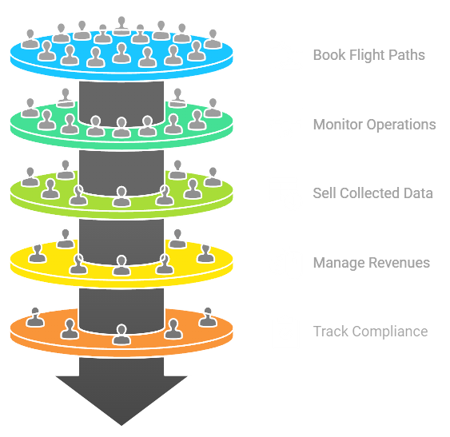

# CivilAirspace

While our skies remain largely unused, property owners and drone operators await clear paths forward. CivilAirspace creates a decentralized coordination layer that enables communities to thoughtfully integrate drone technology into their airspace, ensuring controlled, purposeful usage that respects both innovation and tranquility.

 

# [Airspace Owner App](docs/Airspace_Owner_App.md)
A dedicated mobile application for property owners to:
- Set up and manage airspace schedules
- Configure usage parameters
- Set pricing preferences
- Monitor airspace activity
- Manage CIVIL token earnings
- View analytics and reports

# [Drone Operator App](docs/Drone_Operator_App.md)
A specialized interface for drone operators to:
- Discover available airspace
- Book flight paths
- Monitor operations
- Sell collected data
- Manage CIVIL token revenues
- Track compliance

# [Nodes](docs/Nodes.md)

1. **[Control Towers](docs/Control_Towers.md)**
   - Real-time airspace coordination
   - Traffic management and routing
   - Human operator interface
   - Emergency response coordination
   - Performance monitoring
   - Compliance enforcement

2. **[Credentialing Nodes](docs/Credentialing_Nodes.md)**
   - Participant validation
   - Credential verification
   - Airspace ownership verification
   - Compliance monitoring
   - Changes in ownership/credentials

3. **[Droneports](docs/Droneports.md)**
   - Droneport operations
   - Landing/takeoff management
   - Physical infrastructure management

4. **[Safety Nodes](docs/Safety_Nodes.md)**
   - Emergency response
   - Local compliance
   - Safety monitoring
   - Incident reporting

# [Tokenomics](docs/Tokenomics.md)
The CIVIL token powers coordination across CivilAirspace, enabling:
- Airspace licensing and payments
- Node operator earnings
- Data marketplaces 
- Network governance

# [Partners](docs/partners/Partners.md)

1. **[Droneports](docs/partners/Droneports.md)**  
   Organizations providing droneports, docking stations, and refueling hubs for our decentralized network.

2. **[Public Safety](docs/partners/Public_Safety.md)**  
   Organizations focused on public safety, emergency response, and disaster relief operations.

3. **[Airspace Owners](docs/partners/Airspace_Owners.md)**  
   Property owners with verified rights to license their airspace for drone operations.