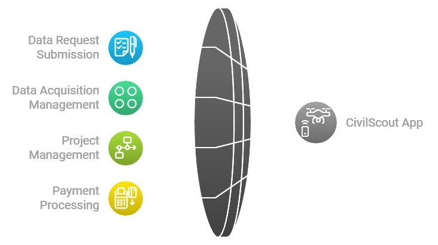

# CivilScout App

The **CivilScout App** is a specialized interface designed for researchers, data consumers, and other parties interested in acquiring aerial data from drone operators within the CivilAirspace network. This app facilitates the submission of data requests, management of data rights, and interaction with drone operators to fulfill specific project needs.

## Core Features

### 1. [Data Request Submission](../docs/Data_Request_Submission.md)
- **[Submit Data Requests](../docs/Submit_Data_Requests.md)**: Users can submit detailed data collection requests (e.g., aerial imagery, environmental data) to drone operators.
- **[Customizable Parameters](../docs/Customizable_Parameters.md)**: Specify location, time frame, altitude, and other parameters for data collection.
- **[Request Templates](../docs/Request_Templates.md)**: Pre-defined templates for common types of data requests (e.g., land surveys, infrastructure inspections).
- **[Real-Time Availability](../docs/Real_Time_Availability.md)**: View available drone operators in real-time and their operational readiness.

### 2. [Data Acquisition Management](../docs/Data_Acquisition_Management.md)
- **[Track Data Requests](../docs/Track_Data_Requests.md)**: Monitor the status of submitted requests, including acceptance, in-progress operations, and completed projects.
- **[Manage Data Rights](../docs/Manage_Data_Rights.md)**: Define ownership and usage rights for collected data. CivilScouts can specify how the data may be used (e.g., exclusive rights or shared use).
- **[Data Delivery](../docs/Data_Delivery.md)**: Receive collected data directly through the app once the operation is completed.

### 3. [Project Management](../docs/Project_Management.md)
- **[Project Dashboard](../docs/Project_Dashboard.md)**: Manage multiple data collection projects simultaneously through a unified dashboard.
- **[Collaborate with Drone Operators](../docs/Collaborate_with_Drone_Operators.md)**: Communicate directly with drone operators to refine project details and ensure successful completion.
- **[Budget Tracking](../docs/Budget_Tracking.md)**: Track project costs and manage payments using CIVIL tokens or other payment methods.

### 4. [Payment Processing](../docs/Payment_Processing.md)
- **[Multiple Payment Options](../docs/Multiple_Payment_Options.md)**: Support for various payment methods (e.g., crypto, fiat) to facilitate transactions between CivilScouts and drone operators.
- **[Payment Milestones](../docs/Payment_Milestones.md)**: Set up milestone-based payments to ensure that funds are only released upon successful completion of project phases.

#### [Payment with CIVIL Tokens](../docs/Payment_with_CIVIL_Tokens.md)
- CivilScouts use CIVIL tokens to pay for data collection services. Smart contracts ensure that payments are only released when specific conditions are met, such as successful data delivery or verification.

## Interface Design

### [Navigation](../docs/Navigation_CivilScout_App.md)
- **[Bottom Bar Access](../docs/Bottom_Bar_Access.md)**: Quick access to key features such as active projects, new data requests, and payment history.
- **[Project Overview Screens](../docs/Project_Overview_Screens.md)**: Easily track ongoing projects with real-time updates on progress and communication with drone operators.

### [Maps Integration](../docs/Maps_Integration_CivilScout_App.md)
- **[Location-Based Requests](../docs/Location_Based_Requests.md)**: Use an interactive map to specify areas where aerial data is needed.
- **[Operator Availability](../docs/Operator_Availability_CivilScout_App.md)**: View available drone operators in specific regions who can fulfill data requests.

## Technical Requirements

### [Device Compatibility](../docs/Device_Compatibility_CivilScout_App.md)
- iOS 14.0 or later
- Android 10.0 or later
- Tablet-optimized interface
- Landscape/Portrait orientation support

### [Network Requirements](../docs/Network_Requirements_CivilScout_App.md)
- Stable internet connection for real-time communication with drone operators.
- Secure communication protocols for submitting requests and receiving data.

## Security Features

### [Security Features Overview](../docs/Security_Features_CivilScout_App.md)
- **[End-to-End Encryption](../docs/End_to_End_Encryption_CivilScout_App.md)**: End-to-end encryption for all communications between CivilScouts and drone operators.
- **[Secure Token Storage](../docs/Secure_Token_Storage_CivilScout_App.md)**: Secure token storage for transactions and project payments.
- **[Multi-Factor Authentication (MFA)](../docs/Multi_Factor_Authentication_CivilScout_App.md)**: Multi-factor authentication for account security.