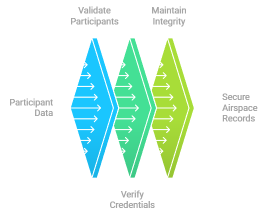

# Credentialing Nodes

Credentialing nodes are essential components of the CivilAirspace network, responsible for validating participants, verifying credentials, and maintaining the integrity of airspace ownership records.

## Core Functions

### Participant Validation
- Identity verification
- Operator certification
- License validation
- Insurance verification
- Background checks
- Compliance history
- **Remote ID Verification**: Validate Remote ID information provided by drone operators, including drone serial numbers and operator registration details.

### Credential Management
- Certificate issuance
- Credential updates
- Expiration tracking
- Revocation handling
- Status monitoring
- Audit logging
- **Remote ID Credentialing**: Issue cryptographic credentials linked to verified Remote ID data, allowing drones to operate within CivilAirspace.

### Ownership Verification
- Airspace rights validation
- Property ownership verification
- Title verification
- Rights transfer processing
- Boundary validation
- Historical records

## Technical Requirements

### Hardware Specifications
- Secure computing environment
- High-availability systems
- Redundant storage
- Network security hardware
- Backup systems
- Physical security measures

### Network Requirements
- Secure communication channels
- Encrypted data transfer
- High-bandwidth connectivity
- Low-latency connections
- Redundant networking
- Failover capabilities

## Operational Protocols

### Verification Process
- Document validation
- Digital signature verification
- Multi-factor authentication
- Real-time status checks
- Compliance verification 
  - **Remote ID Compliance**: Ensure that drones meet Remote ID requirements by cross-checking provided Remote ID data with authoritative databases (e.g., FAA databases).
  - **Ongoing Monitoring**: Continuously monitor drones during flight to ensure they are broadcasting valid Remote IDs.
  
### Data Management 
- Secure storage 
  - **Remote ID Data Storage**: Store Remote ID credentials securely and ensure they are accessible to authorized nodes (e.g., control towers, safety nodes).
  
## Integration Points

### Network Nodes 
  - Control towers 
  - Safety nodes 
  - Droneports 
  - Other credentialing nodes 
  - Emergency services 
  - Regulatory systems
  
### External Systems 
  - Government databases 
    - **Remote ID Databases**: Integrate with government or regulatory databases (e.g., FAA) to validate Remote ID information.
  - Insurance providers 
  - Certification authorities 
  - Property registries 
  - Regulatory bodies 
  - Law enforcement

## Security Measures

### Access Control 
  - Role-based access 
  - Multi-factor authentication 
  - Audit logging 
  - Session management 
  - Permission controls 
  - Security monitoring 

### Data Protection 
  - Encryption at rest 
    - **Remote ID Data Encryption**: Ensure that all Remote ID-related data is encrypted both at rest and in transit.
  - Secure transmission 
  - Key management 
  - Privacy controls 
    - **Privacy for Remote ID Data**: Protect the privacy of drone operators by ensuring that only authorized parties can access Remote ID information.
    
---

### Summary of Changes:
1. **Participant Validation**: Added a new bullet point for **Remote ID Verification**, explaining how credentialing nodes will validate drone operators' Remote IDs.
2. **Credential Management**: Added a new bullet point for issuing cryptographic credentials linked to verified Remote IDs.
3. **Operational Protocols**: Expanded the compliance section to include **Remote ID Compliance**, describing how credentialing nodes will ensure ongoing compliance with Remote ID regulations.
4. **Data Management**: Added a section on securely storing and managing Remote ID credentials.
5. **Integration Points**: Mentioned integration with government or regulatory databases for validating Remote IDs.
6. **Security Measures**: Included additional security measures specific to protecting and encrypting Remote ID data.