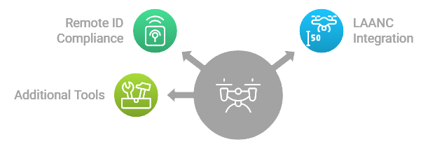

# Drone Operator App

The **Drone Operator App** is a specialized interface designed for drone operators to manage their operations, discover available airspace, comply with regulations (including **[Remote ID](../docs/Remote_ID_Verification.md)** and **[LAANC](../docs/LAANC_Authorization_Check.md)**), and monetize collected data through the CivilAirspace network. The app provides tools for flight planning, real-time monitoring, data marketplace participation, and token management.

## Core Features

### 1. [Operations Management](../docs/Operations_Management.md)
- **[Interactive Map Interface](../docs/Interactive_Map_Interface.md)**: Discover available airspace, restricted zones, and optimal flight paths using an intuitive map interface.
- **[Real-Time Route Visualization](../docs/Real_Time_Route_Visualization.md)**: View live flight paths and adjust routes in real-time based on dynamic conditions.
- **[AI-Powered Route Optimization](../docs/AI_Powered_Route_Optimization.md)**: Automatically optimize routes considering weather conditions, airspace availability, and compliance requirements.
- **[Quick Access Controls](../docs/Quick_Access_Controls.md)**: Access essential functions like emergency landing, return-to-home, and manual overrides with a single tap.
- **[Status Monitoring & Alerts](../docs/Status_Monitoring_Alerts.md)**: Receive real-time alerts for compliance issues, airspace restrictions, or operational anomalies during flights.
- **[Remote ID Compliance](../docs/Remote_ID_Verification.md)**: Automatically broadcast Remote ID during operations to ensure compliance with regulatory requirements.
- **[LAANC Integration](../docs/LAANC_Authorization_Check.md)**: File flight plans with LAANC for real-time flight authorization in controlled airspace.

### 2. Scheduling & Planning
- **Calendar-Based Scheduling**: Plan flights using an intuitive calendar interface with time slot management.
- **Automated Compliance Checks**: Ensure that all scheduled flights meet Remote ID and LAANC requirements before takeoff.
  - **[Remote ID Verification](../docs/Remote_ID_Verification.md)**: Validate that drones are broadcasting valid Remote IDs before flight.
  - **[LAANC Authorization Check](../docs/LAANC_Authorization_Check.md)**: Confirm that flights in controlled airspace have received proper LAANC approval.
- **Advanced Route Planning**: Plan complex routes with multiple waypoints and optimized paths.
- **Weather Integration**: Receive real-time weather updates to adjust flight plans accordingly.

### 3. [Data Marketplace](../docs/Data_Marketplace.md)
- **[Sell Collected Drone Data](../docs/Sell_Collected_Drone_Data.md)**: List collected data (e.g., aerial imagery, environmental data) on the CivilAirspace marketplace for sale or licensing.
- **[Track Earnings](../docs/Track_Earnings.md)**: Monitor earnings from data sales or licensing agreements in real-time through the app’s dashboard.
- **[Manage Data Rights](../docs/Manage_Data_Rights.md)**: Set terms for data usage (e.g., exclusive rights or shared use) when listing data on the marketplace.
- **[Enhanced Marketplace Features](../docs/Enhanced_Marketplace_Features.md)**: Filter potential buyers based on industry (e.g., research, infrastructure) and negotiate terms directly within the app.
- **[Multiple Payment Options](../docs/Multiple_Payment_Options.md)**: Accept payments in CIVIL tokens or other supported currencies.
- **[Data Quality Verification](../docs/Data_Quality_Verification.md)**: Ensure that all listed data meets quality standards set by the network before being sold.

### 4. Token Management
- **CIVIL Token Balance Display**: View your current balance of CIVIL tokens earned through data sales or project participation.
- **Transaction History**: Track all incoming and outgoing transactions related to earnings, payments, and rewards.
- **Earnings Analytics**: Analyze earnings trends over time to optimize future operations and pricing strategies.
- **Payment Processing & Smart Contracts Integration**: Use smart contracts to automate payments for completed projects. Payments are only released once data is verified by the network.

### 5. CivilScout Data Requests Monitoring
Drone operators can monitor what **CivilScouts** are requesting in terms of aerial data through the app. This feature allows operators to:
  - View ongoing data collection requests from CivilScouts.
  - Evaluate project parameters such as location, time frame, and specific data needs.
  - Field responses to these gigs or projects by accepting or declining requests based on feasibility or profitability.
  - Manage multiple projects simultaneously and prioritize based on earnings potential or operational feasibility.
  - Stay informed about upcoming opportunities and adjust their flight schedules accordingly.

## Compliance Features

### Remote ID Integration
The Drone Operator App integrates with Remote ID systems to ensure that all drone operations comply with regulatory requirements. Key features include:
- **Automatic Remote ID Broadcast**: The app automatically broadcasts the drone's Remote ID during flight to comply with regulations.
- **Credential Verification**: The app verifies that the operator's Remote ID is valid and linked to their credentials stored on the CivilAirspace network.
- **Compliance Monitoring**: Real-time monitoring of Remote ID broadcasts ensures continuous compliance during flight.

### LAANC Integration
The app integrates seamlessly with the FAA’s LAANC system to provide real-time flight authorization in controlled airspace. Key features include:
- **Flight Plan Submission**: Operators can submit flight plans directly through the app for approval in controlled airspace zones.
- **Real-Time Authorization Feedback**: Receive near-instant approval or denial from LAANC based on airspace restrictions and operational parameters.
- **Compliance Tracking & Monitoring**: Ensure that all flights in controlled airspace have received proper authorization before takeoff.

## Interface Design

### Navigation
- Bottom bar quick access to key features like scheduling, live flights, marketplace listings, and token management.
- Gesture-based controls for intuitive navigation through different sections of the app (e.g., maps interface, project dashboard).
- Context-aware menus that adapt based on current operations (e.g., emergency override capabilities during active flights).

### Maps Integration
- Real-time location tracking of active flights with live telemetry data displayed on an interactive map interface.
- Available airspace visualization including restricted zones where LAANC authorization is required.
  - **[LAANC Airspace Visualization](../docs/LAANC_Authorization_Check.md)**: View controlled airspace zones where LAANC authorization is required before takeoff.
  - **[Remote ID Zones Visualization](../docs/Remote_ID_Verification.md)**: Visualize areas where enhanced Remote ID compliance is required based on local regulations.

### Status Monitoring
Operators receive real-time status updates about ongoing operations:
  - **[Remote ID Status Monitoring](../docs/Remote_ID_Verification.md)**: Track whether the drone is broadcasting a valid Remote ID during flight at all times.
  - **[LAANC Authorization Status Monitoring](../docs/LAANC_Authorization_Check.md)**: Monitor whether flights in controlled airspace have received proper authorization before takeoff.

### Data Ownership & Licensing
Drone operators can view their share of ownership in each dataset they generate through the app. The app also provides insights into potential earnings from data sales or licensing agreements facilitated by the network:
  - Operators retain ownership of their generated data but can license it to multiple parties through smart contracts managed by the network.

### Operator Rewards & Incentives
Drone operators earn additional rewards for maintaining compliance with network standards and contributing high-quality data:
  - Rewards are distributed in CIVIL tokens based on performance metrics such as compliance rates, data quality scores, and mission success rates.

## Technical Requirements

### Device Compatibility
The Drone Operator App is designed to run smoothly across a wide range of devices:
  - iOS 14.0 or later
  - Android 10.0 or later
  - Tablet optimization for larger screens
  - Support for both landscape and portrait orientations

### Network Requirements
To ensure seamless operation of core features like LAANC submissions and Remote ID broadcasts:
  - Stable internet connection required for real-time communication with network nodes (e.g., control towers).
  - Offline mode capabilities are available for non-controlled airspace operations where internet connectivity may be limited.

## Security Features  
To protect sensitive information such as credentials, payments, and operational data:
  - End-to-end encryption for all communications between drones, operators, and network nodes (including Remote ID broadcasts).
  - Secure token storage using industry-standard encryption protocols for credentials and payment processing information.
  - Multi-factor authentication (MFA) to ensure account security across devices.
  - Real-time threat detection mechanisms to prevent unauthorized access or tampering during operations.

---
