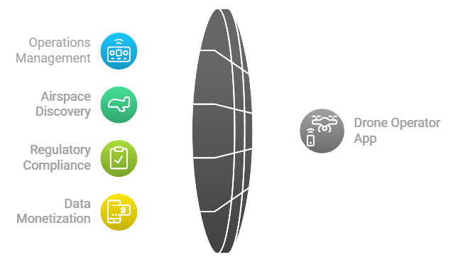

# Drone Operator App

A specialized interface for drone operators to manage operations, discover available airspace, comply with regulations (including Remote ID and LAANC), and monetize collected data through the CivilAirspace network.

## Core Features

### 1. Operations Management
- Interactive map interface for airspace discovery
- Real-time route visualization
- AI-powered route optimization
- Quick access controls for essential functions
- Status monitoring and alerts
- **Remote ID Compliance**: Automatically broadcast Remote ID during operations and ensure compliance with regulatory requirements.
- **LAANC Integration**: File flight plans with LAANC for real-time flight authorization in controlled airspace.
- Additional compliance tools integration

### 2. Scheduling & Planning
- Calendar-based operation scheduling (39:08 format)
- Time slot management
- Operation status tracking
- Automated compliance checking
  - **Remote ID Verification**: Ensure that all flights meet Remote ID requirements before takeoff.
  - **LAANC Authorization Check**: Ensure that flights in controlled airspace have received proper LAANC approval.
- Advanced route planning
- Weather integration

### 3. Data Marketplace
- Sell collected drone data
- Track earnings ($9,04,85.00)
- Monitor active contracts
- Manage data rights
- Enhanced marketplace features
- Multiple payment options
- Data quality verification

### 4. Token Management
- CIVIL token balance display (7,800)
- Transaction history
- Earnings analytics
- Payment processing
- Expanded payment options
- Smart contract integration

### 5. CivilScout Data Requests Monitoring **(New Section)**
Drone operators can monitor what **CivilScouts** are requesting in terms of aerial data through the app. This feature allows operators to:
  - View ongoing data collection requests from CivilScouts.
  - Evaluate project parameters such as location, time frame, and specific data needs.
  - Field responses to these gigs or projects by accepting or declining requests.
  - Manage multiple projects simultaneously and prioritize based on earnings potential or operational feasibility.
  - Stay informed about upcoming opportunities and adjust their flight schedules accordingly.

## Remote ID Integration

The Drone Operator App integrates with Remote ID systems to ensure that all drone operations comply with regulatory requirements. Key features include:
- **Automatic Remote ID Broadcast**: The app automatically broadcasts the drone's Remote ID during flight.
- **Credential Verification**: The app verifies that the operator's Remote ID is valid and linked to their credentials stored on the CivilAirspace network.
- **Compliance Monitoring**: Real-time monitoring of Remote ID broadcasts to ensure continuous compliance during flight.

## LAANC Integration

The app integrates with the FAA’s LAANC system to provide real-time flight authorization in controlled airspace. Key features include:
- **Flight Plan Submission**: Operators can submit flight plans directly through the app for approval in controlled airspace.
- **Real-Time Authorization**: Receive near-instant approval or denial from LAANC based on airspace restrictions.
- **Compliance Tracking**: Ensure that all flights in controlled airspace have received proper authorization before takeoff.

## Interface Design

### Navigation
- Bottom bar quick access
- Gesture-based controls
- Context-aware menus
- Emergency override capabilities

### Maps Integration
- Real-time location tracking
- Available airspace visualization (including restricted zones)
  - **LAANC Airspace Visualization**: View controlled airspace zones where LAANC authorization is required.
  - **Remote ID Zones**: Visualize areas where enhanced Remote ID compliance is required.
  
### Status Monitoring
- Operation status indicators
  - **Remote ID Status Monitoring**: Track whether the drone is broadcasting a valid Remote ID during flight.
  - **LAANC Authorization Status**: Monitor whether flights in controlled airspace have received proper authorization.

## Technical Requirements

### Device Compatibility
- iOS 14.0 or later
- Android 10.0 or later
- Tablet-optimized interface
- Landscape/Portrait orientation support

### Network Requirements
- Stable internet connection for real-time LAANC submissions and Remote ID broadcasts.
  - Offline mode capabilities for non-controlled airspace operations.

### Security Features  
  - End-to-end encryption for all communications, including Remote ID data and LAANC submissions.
  - Secure token storage for credentials and payment processing.
  - Multi-factor authentication for account security.
  - Real-time threat detection to prevent unauthorized access or data breaches.
