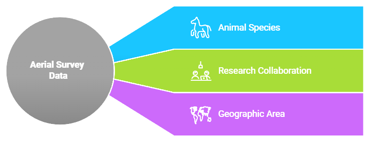
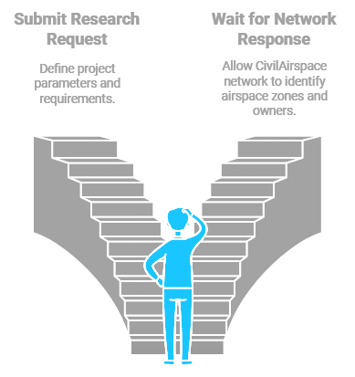

# Research Data Collection Use Case

## Scenario Overview
A university research team uses their CivilScout account to request aerial survey data to study animal species distribution in a specific geographic area. This case demonstrates how CivilAirspace facilitates collaboration between CivilScouts, airspace owners, and drone operators.

## Workflow

### 1. Research Request Submission
The university research team, through their CivilScout interface:
- Specifies geographic boundaries of study area
- Defines required flight altitudes
- Sets data collection frequency
- Details image/sensor requirements
- Outlines project timeline
- Provides research budget parameters

### 2. Network Response
CivilAirspace network automatically:
- Identifies relevant airspace zones
- Locates participating airspace owners
- Calculates optimal flight paths
- Estimates data collection costs
- Generates default licensing terms

### 3. Airspace Owner Association
- Owners receive automated notifications
- System forms temporary ad-hoc association
- Default terms presented to all parties
- Owners can modify or accept terms
- Smart contract manages group consensus

### 4. Service Agreement
Terms include:
- Access schedules
- Compensation rates
- Data usage rights
- Collection parameters
- Quality requirements
- Delivery timeline

### 5. Operational Execution
- Qualified drone operators bid on collection tasks
- Network coordinates flight operations
- Real-time monitoring of data collection
- Quality assurance checks
- Progress tracking
- Compliance verification

### 6. Value Distribution
Smart contracts manage:
- Research team payments
- Airspace owner compensation
- Drone operator fees
- Network service fees
- Data verification rewards

#### Tokenomics Integration
CIVIL tokens are used to facilitate transactions for data collection services. Drone operators receive tokens as compensation for their contributions, while the CivilAirspace network takes a portion of earnings to cover operational costs. Smart contracts automate these transactions, ensuring transparency and fairness.

### 7. Data Delivery
- Verified data stored on IPFS
- Access granted to research team
- Usage rights transferred
- Citation requirements established
- Data provenance recorded

#### Data Provenance
- All collected data is verified and stored on IPFS with blockchain-based provenance tracking. This ensures that researchers can trust the authenticity of the data, with clear records of who generated it and when it was collected.

## Benefits

### For Researchers
- Streamlined data acquisition
- Quality assured data
- Clear pricing
- Simplified coordination
- Verified data provenance

### For Airspace Owners
- Automated licensing
- Fair compensation
- Minimal administration
- Group coordination
- Usage tracking

### For Drone Operators
- Pre-qualified customers
- Clear requirements
- Automated payments
- Optimized routes
- Quality verification

### Data Ownership
The data collected during research operations is jointly owned by the drone operators (data generators) and the CivilAirspace network. This shared ownership ensures that both parties benefit from data monetization while supporting network sustainability.